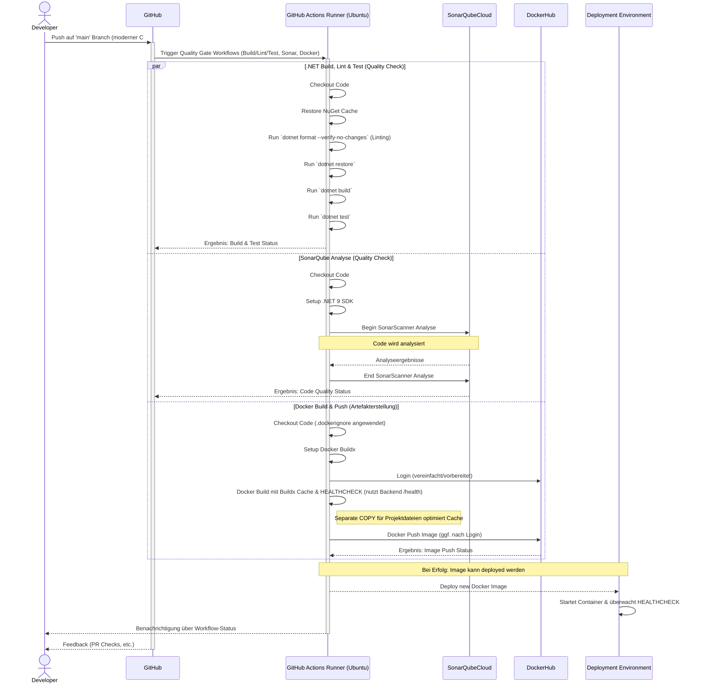

# ADR 001: Verwendung des Strategy Pattern zum Lesen verschiedener Dateitypen

**Status:** Akzeptiert

---

## Kontext

Im Fileservice werden Inhalte aus verschiedenen Dateitypen wie `.txt`, `.pdf` und `.docx` gelesen. Die Art, wie Inhalte aus diesen Formaten ausgelesen werden, unterscheidet sich aufgrund unterschiedlicher Bibliotheken und Verarbeitungslogik.  
Es war notwendig, diese Unterschiede zu kapseln, um die Wartbarkeit, Erweiterbarkeit und Testbarkeit der Anwendung zu verbessern.

---

## Entscheidung

Wir haben uns entschieden, das **Strategy Pattern** zur Implementierung des Dateilesens zu verwenden.  
Dazu wurde eine Schnittstelle `IFileReaderStrategy` definiert, welche die Methode `string ReadFileContent(string filePath)` bereitstellt. Für jeden unterstützten Dateityp gibt es eine eigene Implementierung:

- `TxtFileReader` für `.txt`
- `PdfFileReader` für `.pdf`
- `DocxFileReader` für `.docx`

Der `FileService` erhält zur Laufzeit alle registrierten Strategien per Dependency Injection und wählt anhand der Dateierweiterung zur Ausführungszeit die passende aus.

---

## Gründe für diese Entscheidung

- **Offen für Erweiterung, geschlossen für Modifikation (Open/Closed Principle)**: Neue Dateiformate können einfach durch zusätzliche Strategien ergänzt werden, ohne bestehende Logik im `FileService` zu verändern.
- **Saubere Trennung von Verantwortlichkeiten**: Jede Lesestrategie ist nur für ein Format zuständig, wodurch der Code verständlich und wartbar bleibt.
- **Testbarkeit**: Strategien lassen sich einzeln testen oder durch Mocks im `FileService` ersetzen.
- **Flexibilität durch DI**: Die lose Kopplung ermöglicht einfache Integration weiterer Dateitypen ohne Eingriff in die zentrale Geschäftslogik.

---

## Alternativen

- **Direkte Formatbehandlung im `FileService`**  
  _Nachteile_: schwer testbar, schlecht wartbar, verletzt SRP (Single Responsibility Principle).

- **Factory Pattern statt Strategy Pattern**  
  _Nachteil_: Die Factory wäre hier unnötig, da keine komplexe Initialisierung erforderlich ist und die Strategien direkt aufgerufen werden können.

---

## Konsequenzen

- Zusätzlicher Initialaufwand bei der Einführung des Patterns (Schnittstelle + konkrete Klassen).
- Alle unterstützten Formate müssen manuell als Strategien registriert werden.
- Das DI-System (z. B. `Microsoft.Extensions.DependencyInjection`) muss korrekt konfiguriert sein, damit alle Strategien verfügbar sind.

---

# ADR 002: Verwendung von OpenAI zur automatisierten Quizgenerierung

**Status:** Akzeptiert

---

## Kontext

Ein zentrales Feature der Anwendung besteht darin, aus hochgeladenen Inhalten automatisch Quizfragen zu generieren. Eine klassische Implementierung mit regelbasierten Algorithmen wäre unflexibel, aufwendig in der Pflege und qualitativ limitiert.

---

## Entscheidung

Wir haben uns entschieden, das Sprachmodell **OpenAI GPT** über die öffentliche API zu integrieren, um Inhalte zu analysieren und daraus Fragen zu erstellen.  
Die Klasse `CardDeckGenerationServiceOpenAI` kapselt diese Funktionalität und sendet vorbereitete Texte zur Analyse an das Modell. Das Resultat wird anschließend als Fragenset zurückgegeben und an den Benutzer weitergereicht.

---

## Gründe für diese Entscheidung

- **Hohe Qualität** der generierten Inhalte durch leistungsfähige KI
- **Minimale Entwicklungszeit**, da keine eigene NLP-Logik notwendig ist
- **Einfache Erweiterbarkeit**: Parametrisierung des Prompts erlaubt flexible Anpassung des Outputs
- **Skalierbarkeit** durch Auslagerung der Rechenleistung an einen externen Dienst

---

## Alternativen

- **Regelbasierte Fragegenerierung im Backend**  
  _Nachteil_: Eingeschränkte Qualität und hoher Wartungsaufwand

- **Verwendung von Open-Source-Modellen lokal**  
  _Nachteil_: Komplexe Infrastruktur, hoher Ressourcenverbrauch

---

## Konsequenzen

- Abhängigkeit von einem externen Anbieter (OpenAI)
- Notwendigkeit zur Absicherung und Verwaltung von API-Schlüsseln
- Laufende Kosten abhängig vom Nutzungsvolumen
- Fehlerbehandlung und Ratenbegrenzung müssen berücksichtigt werden

---
# ADR 003: Verwendung von Dependency Injection (DI) für lose Kopplung der Services

**Status:** Akzeptiert

---

## Kontext

Die Anwendung verwendet mehrere Services (z. B. `FileService`, `CardDeckGenerationServiceOpenAI`, diverse `IFileReaderStrategy`-Implementierungen), die voneinander abhängig sind. Um die Wiederverwendbarkeit, Testbarkeit und Wartbarkeit dieser Komponenten zu verbessern, sollte eine flexible Möglichkeit zur Verwaltung von Abhängigkeiten gewählt werden.

---

## Entscheidung

Wir haben uns entschieden, das in .NET integrierte **Dependency Injection (DI)**-Framework zu verwenden, um Serviceklassen automatisch bereitzustellen und ihre Abhängigkeiten aufzulösen. Alle benötigten Services und Strategien werden im `Program.cs` registriert und zur Laufzeit injiziert.

---

## Gründe für diese Entscheidung

- **Lose Kopplung**: Komponenten kennen nur ihre Abstraktionen (Interfaces), nicht deren Implementierungen.
- **Testbarkeit**: Abhängigkeiten können in Tests einfach durch Mocks ersetzt werden.
- **Erweiterbarkeit**: Neue Strategien oder Services lassen sich leicht integrieren.
- **Standard in .NET Core**: Kein zusätzlicher externer DI-Container erforderlich.

---

## Alternativen

- **Manuelles Instanziieren von Abhängigkeiten im Code**  
  _Nachteil_: Schwer wartbar, schlechtere Testbarkeit, enge Kopplung der Komponenten.

- **Verwendung eines Drittanbieter-DI-Containers (z. B. Autofac)**  
  _Nachteil_: Höhere Komplexität ohne erkennbaren Mehrwert für dieses Projekt.

---

## Konsequenzen

- Notwendigkeit, alle Services korrekt im DI-Container zu registrieren
- Die Struktur der Klassen muss auf Konstruktorinjektion ausgelegt sein
- Bessere Trennung von Verantwortlichkeiten und klarere Codebasis

---
Okay, I've reviewed the summaries of your pull requests. It seems the core theme across PRs #4, #5, and #6 is the **modernization and optimization of the development lifecycle and CI/CD pipeline**. This involved C# code style updates, Docker build enhancements, and streamlining GitHub Actions workflows for a more efficient trunk-based development approach.

Here's a proposed ADR based on these changes:

---

# ADR 004: Modernisierung und Optimierung der CI/CD-Pipeline und Entwicklungspraktiken zur Etablierung eines Quality Gates

**Status:** Akzeptiert

---

## Kontext

Das AutoQuiz-Projekt benötigte eine Überarbeitung seiner Entwicklungspraktiken und der CI/CD-Pipeline. Ziel war es, die Effizienz zu steigern, die Wartbarkeit zu verbessern und aktuelle Best Practices zu implementieren, um ein robustes Quality Gate zu etablieren. Dies umfasste die Aktualisierung von C#-Code-Konstrukten, die Optimierung von Docker-Builds und die Straffung der GitHub-Actions-Workflows zur Unterstützung einer Trunk-Based Development Strategie. Die bisherigen CI-Workflows auf Windows-Runnern waren langsam und es gab keinen triftigen Grund für diese Wahl.

---

## Entscheidung

Wir haben uns für eine umfassende Modernisierung der Entwicklungsprozesse und der CI/CD-Pipeline entschieden. Diese Entscheidung zielt darauf ab, ein effektives Quality Gate zu schaffen und umfasst drei Hauptbereiche, die durch die Pull Requests #4, #5 und #6 implementiert wurden:

1.  **Code-Modernisierung und -Formatierung (basiert auf PR #4):**
    * Umstellung auf moderne C#-Konstrukte wie file-scoped Namespaces und das `using var`-Pattern zur Verbesserung der Lesbarkeit und Reduzierung von Code-Bloat.
    * Durchsetzung einheitlicher Codeformatierung im gesamten .NET-Backend-Code.
    * Aktualisierung der Swagger-Konfiguration und zugehöriger Test-Instanziierungen.

2.  **Docker-Optimierung und Frontend-Build-Korrekturen (basiert auf PR #5):**
    * Einführung einer `HEALTHCHECK`-Anweisung in Dockerfiles. Diese triggert den .NET Healthcheck-Endpunkt (`/health`) des Backends, um eine zuverlässige Überwachung der Container-Gesundheit sicherzustellen.
    * Optimierung des Docker-Caching-Verhaltens, insbesondere für .NET-Projekte durch separates Kopieren von Projektdateien vor der Wiederherstellung von Abhängigkeiten.
    * Behebung eines Problems im Frontend-Build-Prozess (`npm build`) durch Entfernen der `NODE_ENV=production`-Einstellung während der Build-Phase, um Kompatibilitätsprobleme zu vermeiden.
    * Hinzufügen einer `.dockerignore`-Datei, um unnötige Dateien (wie `node_modules`, `.git` etc.) vom Docker-Build auszuschließen und die Build-Zeiten sowie Image-Größen zu reduzieren.

3.  **Optimierung und Straffung der CI-Workflows für Trunk-Based Development (basiert auf PR #6):**
    * **.NET Build, Lint und Test Workflow:**
        * Umstellung der Ausführungsumgebung von Windows auf Ubuntu, was zu einer deutlichen Reduktion der Laufzeiten führte und die Komplexität verringerte.
        * Implementierung von NuGet-Paket-Caching zur Beschleunigung der Wiederherstellung von Abhängigkeiten bei wiederholten Builds.
        * Integration von `dotnet format --verify-no-changes` als Linting-Schritt zur automatischen Überprüfung und Sicherstellung der Codekonsistenz, was ein Kernelement des Quality Gates darstellt.
    * **SonarQube Workflow:**
        * Aktualisierung zur Verwendung des .NET 9.0 SDK.
        * Umstellung der Ausführungsumgebung auf Ubuntu.
    * **Docker Build Workflow:**
        * Nutzung von Docker Buildx für verbessertes Caching (`--cache-from`, `--cache-to type=inline`).
        * Vereinfachung und Vorbereitung der Docker Hub Authentifizierung.
    * **Workflow-Trigger:** Anpassung der Trigger-Bedingungen, sodass die Workflows primär bei Push-Events und Pull Requests auf den `main`-Branch ausgeführt werden, um eine Trunk-Based Development Strategie zu unterstützen.

---

## Gründe für diese Entscheidung

* **Etablierung eines Quality Gates:** Die Kombination aus Linting, Tests, Code-Analyse und standardisierten Build-Prozessen stellt sicher, dass nur qualitativ hochwertiger Code in den `main`-Branch gelangt.
* **Verbesserte Codequalität und Wartbarkeit:** Moderne C#-Features und einheitliche Formatierung machen den Code lesbarer und einfacher zu warten.
* **Effizientere und schnellere CI/CD-Pipeline:** Der Wechsel zu Ubuntu-Runnern, Docker-Caching-Optimierungen, `.dockerignore` und NuGet-Caching in den CI-Workflows reduzieren die Build-Zeiten signifikant und vereinfachen die Pipeline.
* **Stabilere und zuverlässigere Deployments:** Docker `HEALTHCHECK`s, die den .NET Healthcheck des Backends nutzen, ermöglichen eine bessere Überwachung und schnellere Fehlererkennung. Die Korrektur im Frontend-Build stellt sicher, dass produktionsreife Artefakte erstellt werden.
* **Konsistente Entwicklungsumgebung und CI-Prozesse:** Die Vereinheitlichung der Runner-Umgebungen und die Integration von Linting sorgen für konsistente Ergebnisse und frühzeitige Fehlererkennung.
* **Anpassung an aktuelle Best Practices:** Die Umstellung auf Buildx und die Optimierung der Workflows für Trunk-Based Development spiegeln aktuelle Best Practices wider.
* **Frühzeitige Fehlererkennung:** Linting und automatisierte Tests im CI-Prozess helfen, Fehler frühzeitig zu identifizieren.

---

## Diagramm: Sequenzdiagramm der optimierten CI/CD-Pipeline als Quality Gate

**Erläuterung des Sequenzdiagramms:**

1.  Der **Developer** pusht Code auf den `main`-Branch in **GitHub**.
2.  **GitHub** triggert die als **Quality Gate** konfigurierten GitHub Actions Workflows.
3.  Der **GitHub Actions Runner** (Ubuntu) führt parallel Aufgaben aus:
    * **.NET Build, Lint & Test:** Umfasst Caching, `dotnet format` (Linting), Build und Tests. Meldet Status an GitHub.
    * **SonarQube Analyse:** Codeanalyse mit .NET 9 SDK durch **SonarQubeCloud**. Meldet Qualitätsstatus an GitHub.
    * **Docker Build & Push:** Baut ein optimiertes Docker-Image (mit `.dockerignore`, Buildx-Caching und `HEALTHCHECK`, der den `/health`-Endpunkt des Backends nutzt) und pusht es zu **DockerHub**.
4.  Bei Erfolg aller Quality Checks kann das neue Image in die **Deployment Environment** ausgerollt werden, wo der Container gestartet und sein Zustand über den `HEALTHCHECK` überwacht wird.
5.  **GitHub Actions** und **GitHub** geben dem **Developer** Feedback.

---

## Alternativen

* **Beibehaltung der alten Code-Stile und Workflow-Strukturen (inkl. Windows-Runner):**
    * _Nachteile:_ Weniger effizient, deutlich längere Build-Zeiten, potenziell inkonsistenter Code, keine Nutzung moderner C#-Vorteile, keine optimierten Docker-Images, kein effektives Quality Gate.
* **Nutzung anderer CI/CD-Tools oder spezifischerer Linting-Tools:**
    * _Nachteile:_ Höherer Konfigurationsaufwand, potenziell zusätzliche Kosten, Fragmentierung der Toolchain. GitHub Actions bietet eine integrierte und für das Projekt ausreichende Lösung zur Etablierung des Quality Gates.
* **Manuelle Docker-Builds und -Authentifizierung:**
    * _Nachteile:_ Fehleranfälliger, langsamer, nicht im Sinne einer automatisierten CI/CD-Pipeline und eines Quality Gates.
* **Keine explizite HEALTHCHECK-Anweisung im Dockerfile oder keine Nutzung des Backend-Healthchecks:**
    * _Nachteile:_ Weniger robuste Überwachung der Container-Gesundheit und der tatsächlichen Anwendungsbereitschaft.

---

## Konsequenzen

* **Positive Auswirkungen:**
    * **Etabliertes Quality Gate:** Deutlich verbesserte Code-Qualität und Stabilität im `main`-Branch.
    * **Effizienzsteigerung:** Schnellere und zuverlässigere CI/CD-Prozesse durch Optimierungen und Wechsel auf Ubuntu-Runner.
    * **Verbesserte Entwickler-Experience (DX):** Schnellere Feedback-Zyklen und eine einheitlichere, modernere Codebasis.
    * **Bessere Ressourcennutzung:** Optimierte Builds und kleinere Docker-Images schonen Ressourcen.
    * **Erhöhte Stabilität und Überwachbarkeit von Docker-Containern** durch die Nutzung des Backend-Healthchecks via Docker `HEALTHCHECK`.
    * **Vereinfachte CI-Workflow-Komplexität** durch den Wechsel von Windows auf Ubuntu und die Straffung der Prozessschritte.

* **Einziger wesentlicher Nachteil:**
    * **Notwendigkeit der Team-Disziplin bei Trunk-Based Development:** Das Team muss sich konsequent an die Regeln des direkten Committens auf `main` (oder sehr kurzlebige Feature-Branches mit schnellen Merges und anschließender Löschung) halten, um die Vorteile des Quality Gates voll auszuschöpfen.

---
