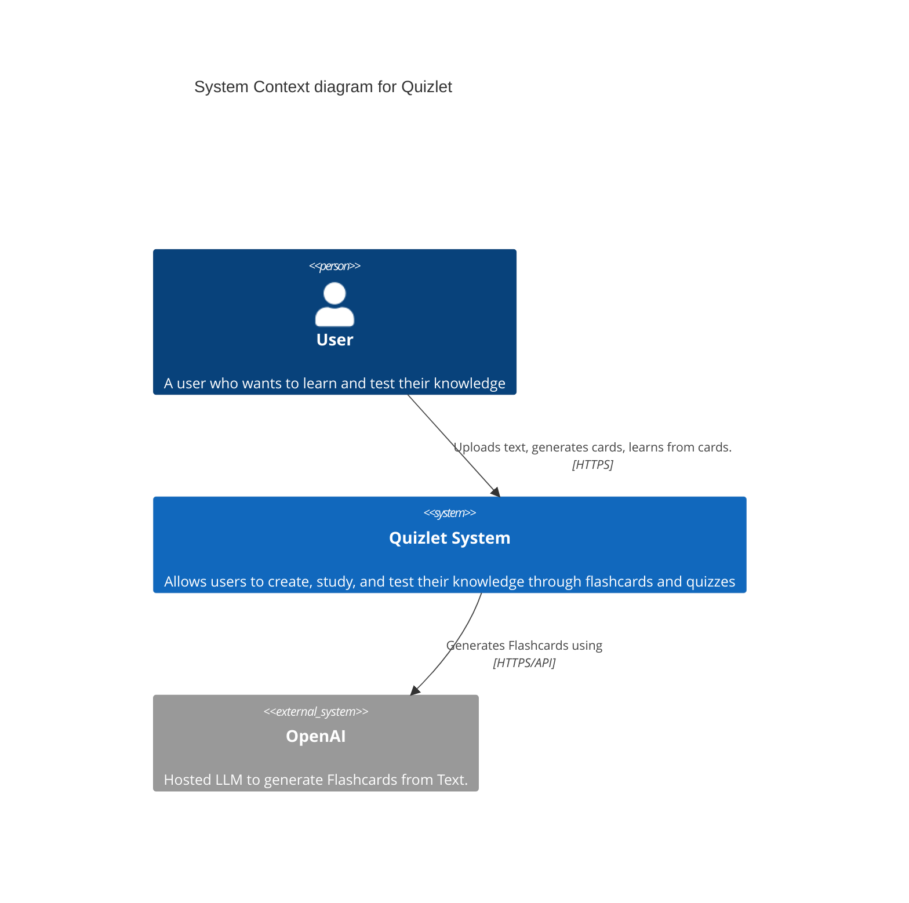

# Quizlet Project Documentation

## System Context Diagram

A C4 context diagram is the highest level of abstraction in the C4 model, providing a big picture view of how your software system interacts with users and other systems. It shows the system as a single box, surrounded by its users and any external systems it interacts with. This level of the C4 model is particularly useful for explaining the system to non-technical stakeholders and understanding the system's scope and boundaries.

This context diagram illustrates Quizlet's core interactions: Users interact with the Quizlet system through a web interface, while the system itself leverages OpenAI's language model capabilities to automatically generate flashcards from text input. The diagram emphasizes that Quizlet is primarily a user-facing application with an AI-powered content generation feature, making it clear that the system's main value proposition is the combination of user interaction and AI-assisted content creation.

## Container Diagram
TODO 
