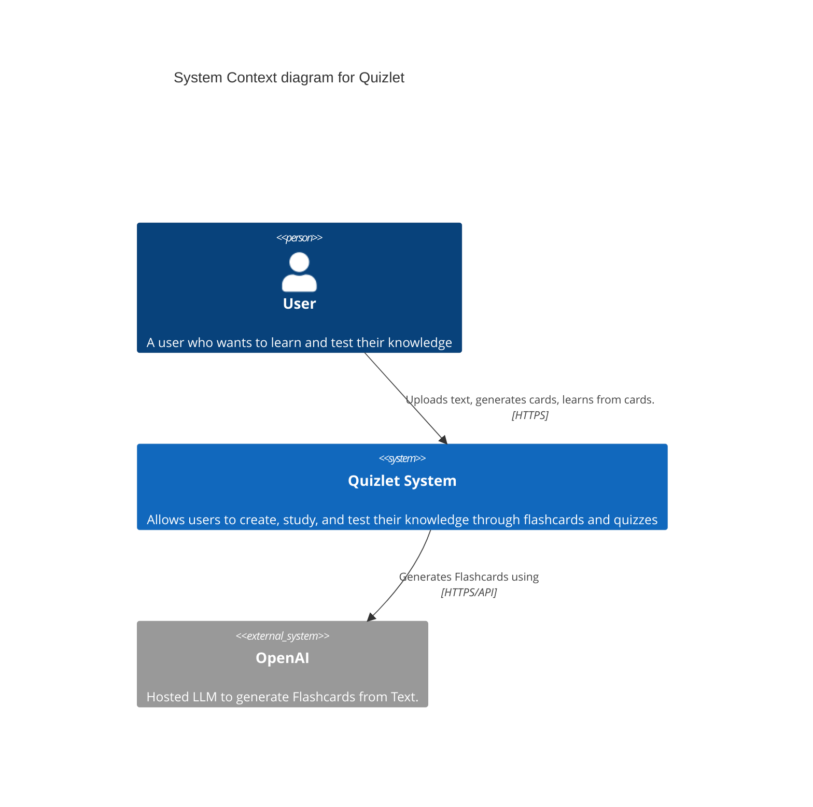
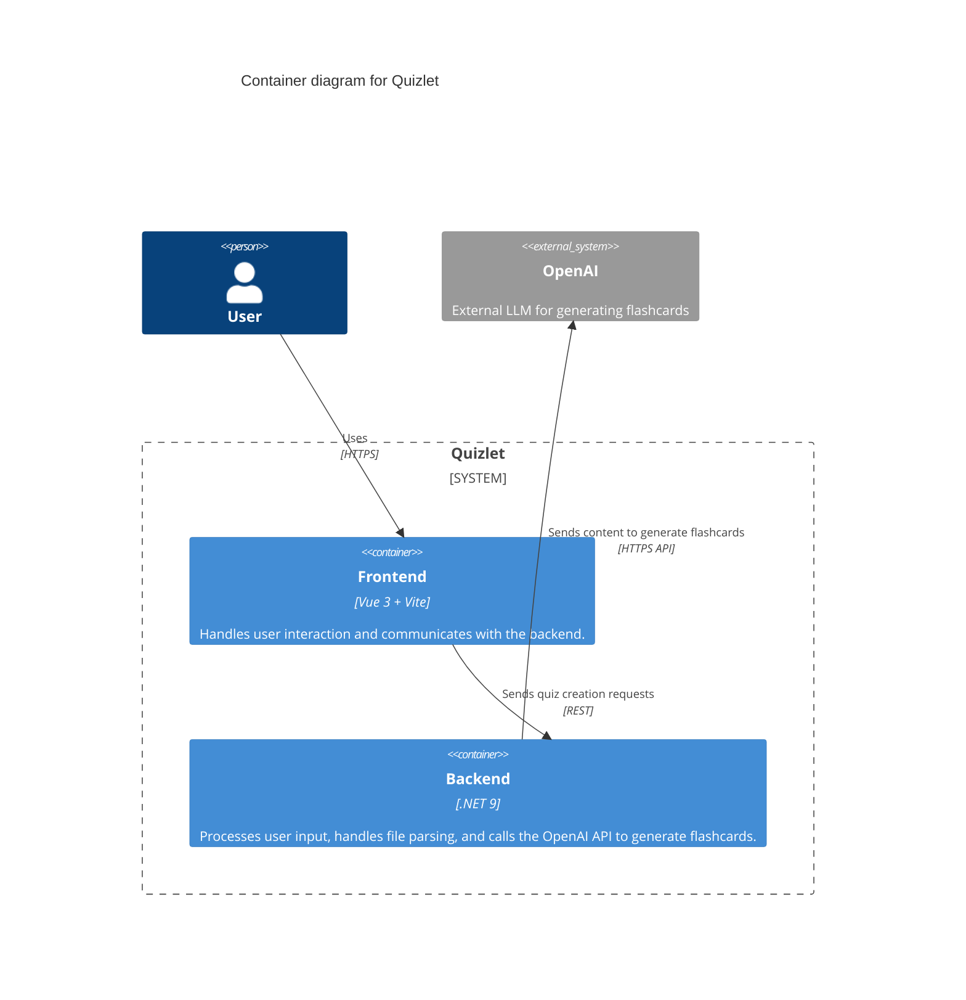
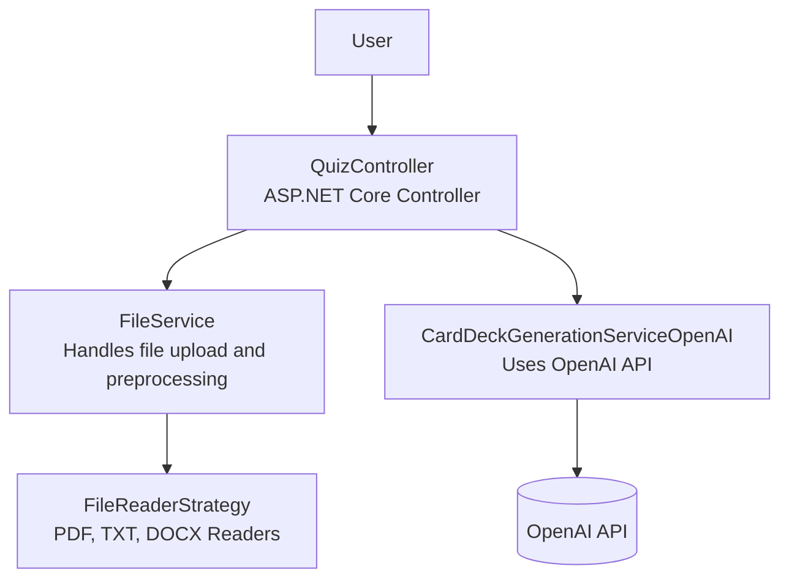

# Quizlet Project Documentation

## 1. Introduction and Goals

Quizlet is a web-based application that allows users to create, study, and test their knowledge through flashcards and quizzes. The system leverages AI (OpenAI) to generate flashcards from user-uploaded text, providing an enhanced learning experience.

## 2. Constraints

- Frontend: Vue 3 + Vite
- Backend: .NET 9
- Integration with OpenAI API for flashcard generation
- Support for multiple file types (PDF, TXT, DOCX)

## 3. System Scope and Context

### 3.1 Business Context

**Explanation:**  
This context diagram illustrates Quizlet's core interactions: Users interact with the Quizlet system through a web interface, while the system itself leverages OpenAI's language model capabilities to automatically generate flashcards from text input. The diagram emphasizes that Quizlet is primarily a user-facing application with an AI-powered content generation feature.

### 3.2 Technical Context

- Users access the system via HTTPS.
- The system communicates with OpenAI via HTTPS/API.

## 4. Solution Strategy

- Modular architecture with clear separation between frontend and backend.
- Use of strategy pattern for file reading to support multiple formats.
- Integration with external AI service (OpenAI) for content generation.

## 5. Building Block View

### 5.1 Level 1: Container Diagram

**Explanation:**  
The frontend, built with Vue 3 and Vite, handles user interaction including uploading documents and initiating quiz creation. It communicates with a .NET 9 backend, which processes the uploaded files, extracts content using file readers, and communicates with the OpenAI API to generate quiz questions.

### 5.2 Level 2: Component Diagram

**Explanation:**  
This diagram provides a deeper look inside the backend container. User requests are routed through the QuizController, which delegates file handling to the FileService and quiz generation to CardDeckGenerationServiceOpenAI. The FileService uses a strategy pattern to handle multiple file types (PDF, TXT, DOCX) via pluggable readers. The CardDeckGenerationServiceOpenAI integrates with the OpenAI API to generate flashcards based on the parsed content.

## 6. Runtime View

- User uploads a document via the frontend.
- Frontend sends the file to the backend.
- Backend processes the file, extracts text, and sends it to OpenAI.
- OpenAI returns generated flashcards, which are sent back to the frontend for user interaction.

## 7. Deployment View

- Frontend and backend are deployed independently.
- Backend requires network access to OpenAI API.

## 8. Cross-cutting Concepts

- Security: HTTPS for all communications.
- Extensibility: Strategy pattern for file readers.
- Scalability: Frontend and backend can be scaled independently.

## 9. Design Decisions
An architecture descision record can be found [here](./adr.md)