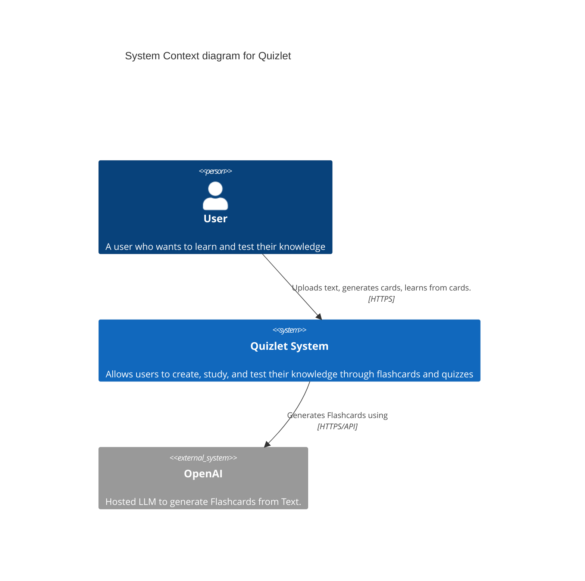
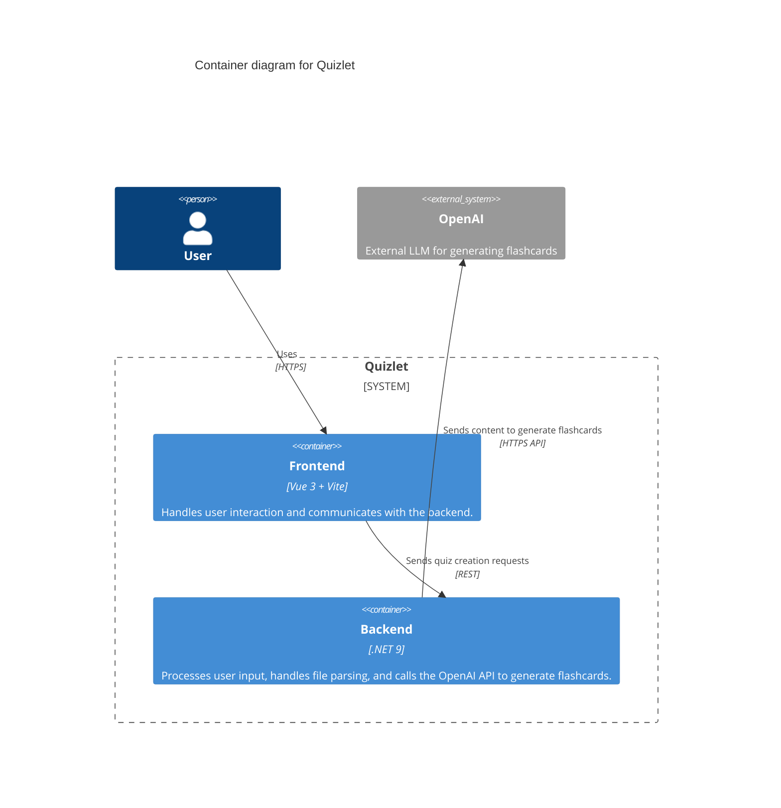
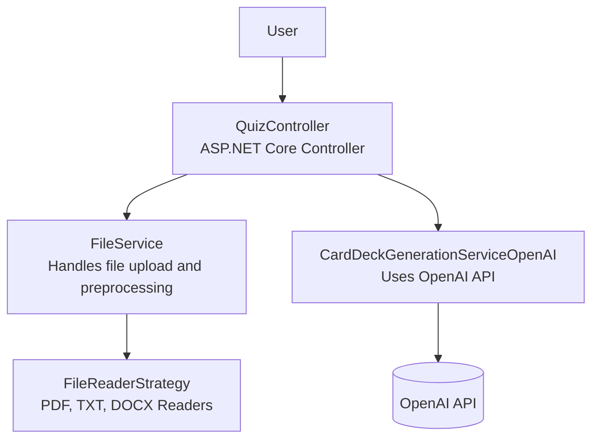

# Quizlet Project Documentation

## System Context Diagram

A C4 context diagram is the highest level of abstraction in the C4 model, providing a big picture view of how your software system interacts with users and other systems. It shows the system as a single box, surrounded by its users and any external systems it interacts with. This level of the C4 model is particularly useful for explaining the system to non-technical stakeholders and understanding the system's scope and boundaries.

This context diagram illustrates Quizlet's core interactions: Users interact with the Quizlet system through a web interface, while the system itself leverages OpenAI's language model capabilities to automatically generate flashcards from text input. The diagram emphasizes that Quizlet is primarily a user-facing application with an AI-powered content generation feature, making it clear that the system's main value proposition is the combination of user interaction and AI-assisted content creation.

## Container Diagram

This container diagram breaks down the Quizlet system into its primary executable parts. The frontend, built with Vue 3 and Vite, handles user interaction including uploading documents and initiating quiz creation. It communicates with a .NET 9 backend, which processes the uploaded files, extracts content using file readers, and communicates with the OpenAI API to generate quiz questions. This separation of concerns allows for modular development and independent scaling of components. The diagram helps developers and architects understand the responsibilities and interactions of each container.

## Component Diagram

The component diagram provides a deeper look inside the backend container. It illustrates how user requests are routed through the QuizController, which delegates file handling to the FileService and quiz generation to CardDeckGenerationServiceOpenAI. The FileService uses a strategy pattern to handle multiple file types (PDF, TXT, DOCX) via pluggable readers. The CardDeckGenerationServiceOpenAI integrates with the OpenAI API to generate flashcards based on the parsed content. This design promotes extensibility, testability, and separation of concerns in the backend architecture.
